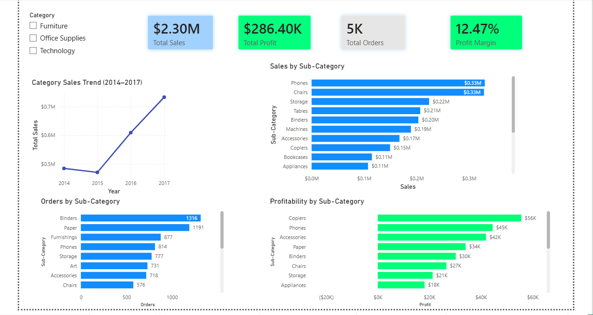
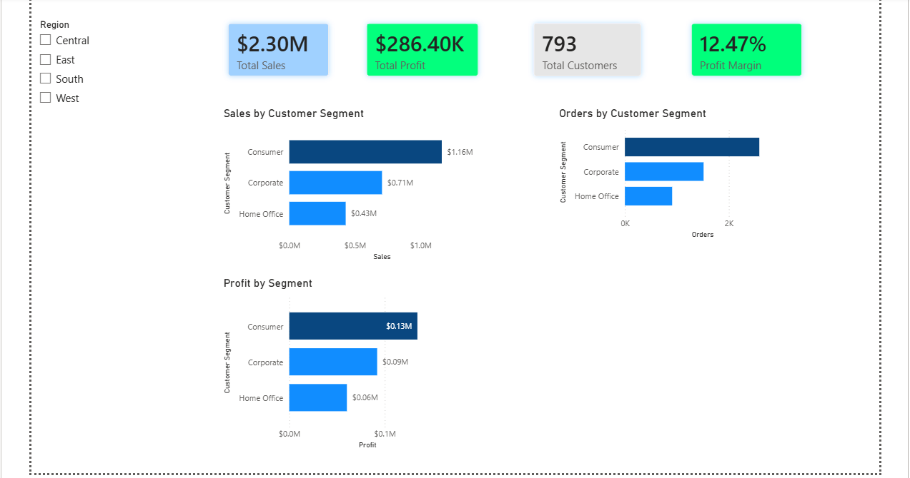

# Business Intelligence Sales Analytics Dashboard | Power BI

##  Project Overview
This project focuses on developing an interactive Business Intelligence dashboard using Microsoft Power BI to analyze retail sales performance based on the Superstore dataset. The dashboard transforms raw transactional data into meaningful business insights through data modeling, KPI reporting, and interactive visualizations.

The project demonstrates practical applications of data analytics and business intelligence techniques to support operational efficiency, performance monitoring, and data-driven decision-making.

---

##  Project Objectives
- Analyze sales, profit, customer behavior, and regional performance
- Identify high-performing and low-performing products and regions
- Develop interactive dashboards for business reporting and analytics
- Apply data modeling and DAX techniques for KPI analysis
- Support strategic business decision-making through visualization

---

##  Dashboard Features
### Executive Summary
- Sales & profit overview
- KPI reporting
- Sales trends over time
- Regional and category performance analysis

### Category Analysis
- Sub-category sales and profitability analysis
- Order distribution analysis
- Category trend visualization

### Product Analysis
- Top-performing products by sales and profit
- Product profitability tracking
- Product-level operational insights

### Sales vs Profit Analysis
- Scatter plot analysis of sales and profit relationship
- Identification of high-sales but low-profit products

### Customer & Regional Analysis
- Customer segmentation analysis
- Top customer identification
- Regional and state-level sales performance

---

##  Tools & Technologies
- Microsoft Power BI
- DAX (Data Analysis Expressions)
- Power Query
- Data Modeling
- Business Intelligence & Data Analytics

---

##  Data Modeling
A star schema data model was implemented consisting of:
- Fact_Sales
- Dim_Customer
- Dim_Product
- Dim_Date
- Dim_Location

This structure improves query performance and supports efficient analytical reporting.

---

##  Key Insights
- Technology category generated the highest sales and profit
- Consumer segment contributed the highest revenue
- West region and California showed strongest overall performance
- Some products achieved high sales but low profitability, indicating pricing or discount inefficiencies

---

##  Dashboard Preview

### Executive Summary


### Category Analysis


### Product Analysis


### Customer Analysis


### Region & State Analysis


---

##  Repository Structure

```text
business-intelligence-sales-dashboard
│
├── screenshots/
├── Superstore_Sales.pbix
├── report.pdf
├── Data-Description - Superstore Sales Dashboard.xlsx
├── Sample - Superstore.xls
└── README.md
